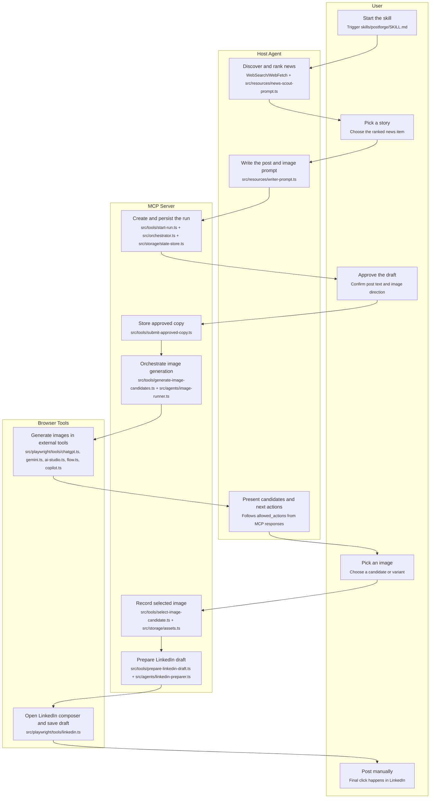
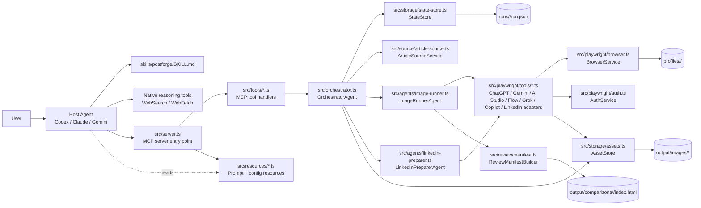
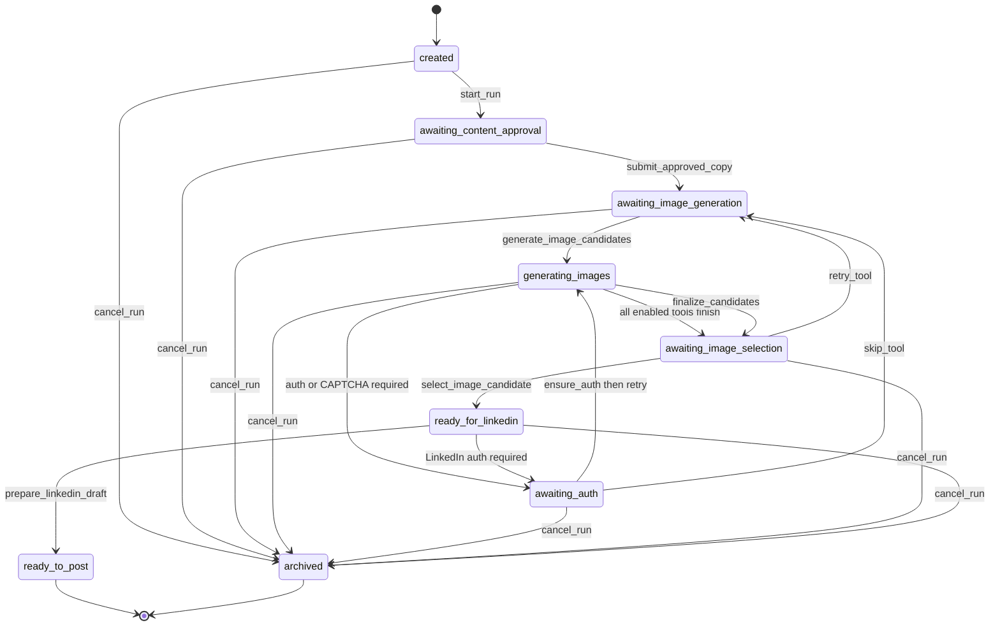
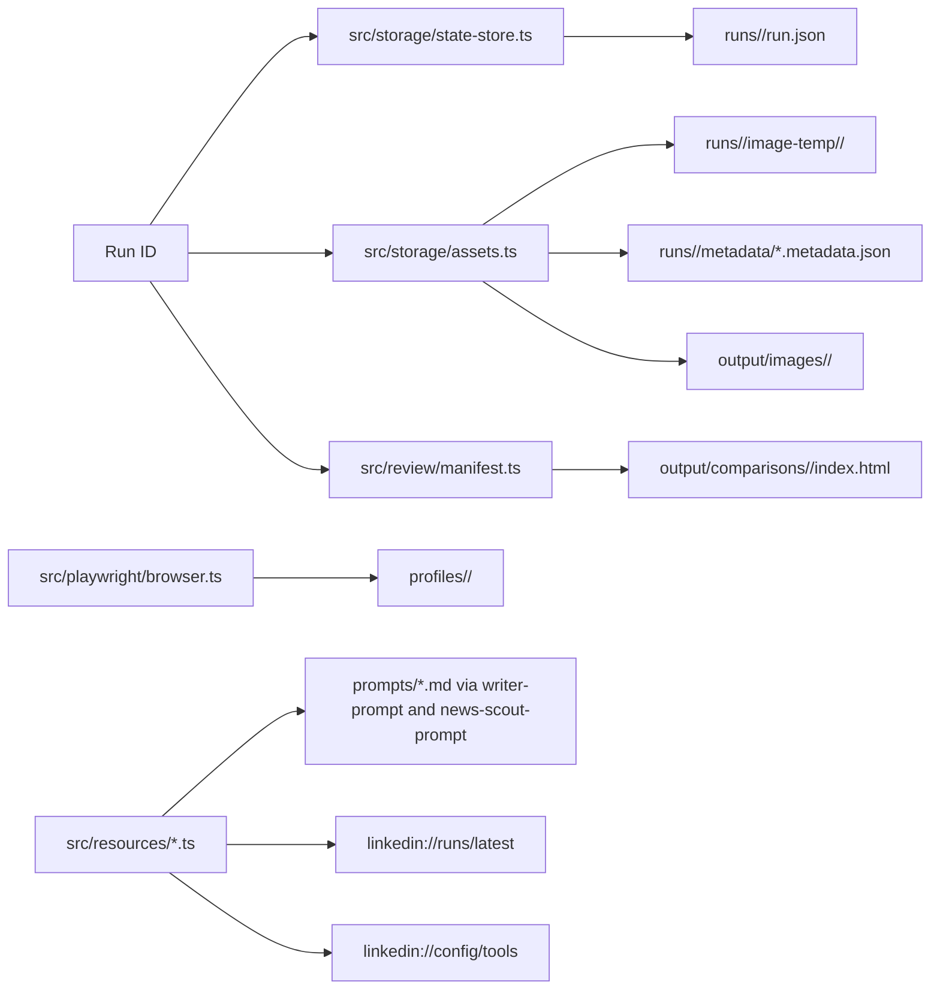

# Architecture

## Visual Maps

The diagrams below intentionally cover different scopes so you can explain the repo from multiple angles:

- Simple end-to-end scope: one compact pipeline from skill start through news discovery, writing, image generation, and LinkedIn draft prep.
- Swimlane scope: the same story, but grouped by who is acting at each step.
- System scope: who activates whom across the host agent, MCP server, orchestration layer, browser layer, and outputs.
- Tool-routing scope: which MCP tools delegate to which classes and files.
- Runtime scope: how a single run advances through stages, including auth, polling, retry, skip, and finalize branches.
- Output scope: which directories and files are created or updated as the run progresses.

The companion browser version lives at `docs/architecture-diagrams.html`.

### Overview

#### 1. Simple End-to-End Pipeline

```mermaid
flowchart LR
    start["Start the post workflow<br/><sub>skills/postforge/SKILL.md</sub>"]
    discover["Find news worth posting about<br/><sub>Host agent + WebSearch/WebFetch + src/resources/news-scout-prompt.ts</sub>"]
    chooseStory["Pick one story to develop<br/><sub>User + host agent</sub>"]
    write["Draft the post and image prompt<br/><sub>Host agent + src/resources/writer-prompt.ts</sub>"]
    saveRun["Create and update the pipeline run<br/><sub>src/tools/start-run.ts + src/tools/submit-approved-copy.ts + src/orchestrator.ts</sub>"]
    images["Generate image candidates across tools<br/><sub>src/agents/image-runner.ts + src/playwright/tools/*.ts</sub>"]
    select["Choose the final image<br/><sub>src/tools/select-image-candidate.ts + src/storage/assets.ts</sub>"]
    linkedin["Prepare the LinkedIn draft<br/><sub>src/agents/linkedin-preparer.ts + src/playwright/tools/linkedin.ts</sub>"]
    post["Post manually in LinkedIn<br/><sub>User action</sub>"]

    start --> discover --> chooseStory --> write --> saveRun --> images --> select --> linkedin --> post
```



#### 2. Swimlane View by Actor



### Architecture

#### 3. System Activation and Delegation



#### 4. MCP Tool Routing to Components

```mermaid
flowchart TD
    subgraph MCP["MCP tools in src/tools/"]
        start[start_run]
        submit[submit_approved_copy]
        generate[generate_image_candidates]
        ensure[ensure_auth]
        finalize[finalize_candidates]
        retry[retry_tool]
        skip[skip_tool]
        select[select_image_candidate]
        prepare[prepare_linkedin_draft]
        status[get_run]
        cancel[cancel_run]
        doctor[doctor]
    end

    subgraph Orchestrator["src/orchestrator.ts"]
        startRun[startRun]
        submitCopy[submitApprovedCopy]
        genImages[generateImages]
        finalizeCandidates[finalizeCandidates]
        clearTool[clearToolAsset]
        skipTool[skipTool / bypassPendingAuth]
        pickImage[pickImageByNumber]
        prepLinkedIn[prepareLinkedIn]
        statusRun[status]
        cancelRun[cancelRun]
    end

    state[src/storage/state-store.ts<br/>StateStore]
    source[src/source/article-source.ts<br/>ArticleSourceService.fetchFromLink]
    imageRunner[src/agents/image-runner.ts<br/>ImageRunnerAgent.runAll]
    auth[src/playwright/auth.ts<br/>AuthService.openAndCheckAuth]
    selected[src/storage/assets.ts<br/>AssetStore.convertSelectedImage]
    linkedin[src/agents/linkedin-preparer.ts<br/>LinkedInPreparerAgent.prepare]
    browser[src/playwright/tools/linkedin.ts<br/>LinkedInAdapter.prepareTextOnly]

    start --> startRun
    submit --> submitCopy
    generate --> genImages
    finalize --> finalizeCandidates
    retry --> clearTool
    skip --> skipTool
    select --> pickImage
    prepare --> prepLinkedIn
    status --> statusRun
    cancel --> cancelRun

    startRun --> state
    startRun --> source
    submitCopy --> state
    genImages --> state
    genImages --> imageRunner
    finalizeCandidates --> state
    clearTool --> state
    skipTool --> state
    pickImage --> selected
    pickImage --> state
    prepLinkedIn --> linkedin
    prepLinkedIn --> state
    ensure --> auth
    statusRun --> state
    linkedin --> browser
```



### Runtime and State

#### 5. Run Lifecycle, Auth Branches, and Control Actions



#### 6. Persistent Outputs and File Surfaces



### Notes on Scope

- The host agent still owns reasoning, writing, ranking, and user-facing decisions. The MCP server owns execution and persistence.
- `RunStage` includes a few reserved or older enum values that are not part of the main current path driven by `OrchestratorAgent`; the diagrams above focus on the active runtime flow.
- `output/linkedin/<runId>/` is provisioned as part of run artifacts, but the current LinkedIn preparation path mainly acts in the browser and opens the selected image folder rather than writing a local draft artifact there.

## Agent Skill Declaration: Claude Code vs Codex

Both agents read the same skill file (`skills/postforge/SKILL.md`) but discover and register it differently.

### Claude Code

No explicit skill registration file. Claude Code uses two layers:

**1. Project guidance — `CLAUDE.md`**
Loaded automatically into every conversation when Claude Code opens this repo. Contains Claude-specific notes: MCP server config format, which native tools to use for web search, and a pointer to the skill as the single source of truth.

**2. Skill frontmatter — `skills/postforge/SKILL.md`**
The `name` and `description` fields in the YAML frontmatter are what Claude Code reads for skill routing. When the user's intent matches the description, Claude Code invokes the skill and loads the full file into context.

**MCP server** is registered manually in `.claude/settings.json` (project) or `~/.claude/settings.json` (global):
```json
{
  "mcpServers": {
    "linkedin-post-agent": {
      "command": "node",
      "args": ["/absolute/path/to/postforge/dist/server.js"]
    }
  }
}
```

### Codex

Uses explicit declaration files:

**1. Project guidance — `AGENTS.md`**
Loaded automatically into every Codex session in this repo. Equivalent role to `CLAUDE.md` — covers repo layout, MCP tool contract, pipeline stages, and authoritative files.

**2. Skill + MCP manifest — `agents/openai.yaml`**
Declares the skill path and the MCP server in a single file. Codex reads this to know what skill to load and how to start the MCP server:

```yaml
name: postforge
skills:
  - path: skills/postforge/SKILL.md
mcp:
  - name: linkedin-post-agent
    command: node
    args:
      - dist/server.js
```

Skills are also symlinked to `~/.agents/skills/postforge` for Codex discovery outside the repo.

### Side-by-side

| | Claude Code | Codex |
|---|---|---|
| Project context file | `CLAUDE.md` | `AGENTS.md` |
| Skill registration | SKILL.md frontmatter | `agents/openai.yaml` |
| MCP registration | `.claude/settings.json` | `agents/openai.yaml` |
| Skill discovery path | `skills/` dir (auto) | `~/.agents/skills/` symlink |
| Skill invocation | Skill tool matches description | yaml path loaded at session start |

---

## Pipeline Call Sequence

```
User
 │
 ├─ provides: link / idea / "find me something"
 │
 ▼
Agent reads skills/postforge/SKILL.md
 │
 ├─────────────────────────────────────────────────────────────
 │  PHASE 0: News Discovery (skip if user gives link or idea)
 ├─────────────────────────────────────────────────────────────
 │
 ├─ WebSearch / WebFetch (native agent tools)
 │   Scans source blogs, GitHub releases, AI news sites
 │   Filters for signal, ranks 1-10, briefs each item
 │
 ├─ Presents ranked briefs → user picks a story
 │
 ├─────────────────────────────────────────────────────────────
 │  PHASE 1: Post Writing
 ├─────────────────────────────────────────────────────────────
 │
 ├─ MCP: start_run(input_text, input_kind)
 │   Server creates a run record, returns run_id
 │   run_id is carried through all remaining phases
 │
 ├─ Agent fetches the link (WebFetch) → extracts source facts
 │
 ├─ Agent generates:
 │   - 10 hook options
 │   - 5 body variations (A–E), no hashtags
 │
 ├─ User picks a combo (e.g. "3B") → agent builds final draft
 │   Applies hashtag logic, appends source link
 │
 ├─ MCP: submit_approved_copy(run_id, post_text, image_prompt)
 │   Server stores approved copy against the run
 │
 ├─────────────────────────────────────────────────────────────
 │  PHASE 2: Image Generation
 ├─────────────────────────────────────────────────────────────
 │
 ├─ Agent suggests 3–5 image concepts → user picks one
 ├─ Agent generates a super-detailed image prompt
 │
 ├─ MCP: generate_image_candidates(run_id)
 │   Server opens Playwright browsers in parallel
 │   For each enabled AI tool (ChatGPT, Gemini, AI Studio,
 │   Flow, Grok, Copilot):
 │     - Navigates to the tool
 │     - Pastes the image prompt
 │     - Waits for image generation
 │     - Captures screenshot
 │   Returns candidates[] with tool_name, status, file_path
 │
 │   ┌─ if auth_required ──────────────────────────────────┐
 │   │  Agent tells user which tool needs login            │
 │   │  Browser is already open — user logs in manually   │
 │   │  MCP: ensure_auth(tool_id) → verify                │
 │   │  MCP: generate_image_candidates(run_id) → resume   │
 │   └─────────────────────────────────────────────────────┘
 │
 │   ┌─ if timeout (120s) ─────────────────────────────────┐
 │   │  Run continues in background                        │
 │   │  MCP: get_run(run_id) → check progress             │
 │   │  When user says "continue" →                        │
 │   │  MCP: generate_image_candidates(run_id) → resume   │
 │   │  (skips tools that already finished)               │
 │   └─────────────────────────────────────────────────────┘
 │
 ├─ Agent presents candidates → user picks one
 │
 ├─ MCP: select_image_candidate(run_id, candidate_number)
 │   Server records the selected image against the run
 │
 ├─────────────────────────────────────────────────────────────
 │  PHASE 3: LinkedIn Draft
 ├─────────────────────────────────────────────────────────────
 │
 ├─ MCP: prepare_linkedin_draft(run_id)
 │   Server opens LinkedIn in a persistent Playwright browser
 │   Fills the composer with approved post text
 │   Opens the image folder for the user to attach manually
 │   Saves as draft — never clicks Post
 │
 └─ Agent tells user: "Draft is ready. Click Post when ready."
     User clicks Post manually in their browser.
```

---

## File Map

```
postforge/
├── skills/
│   └── postforge/
│       └── SKILL.md          # Full pipeline workflow (single source of truth)
├── agents/
│   └── openai.yaml           # Codex skill + MCP declaration
├── src/                      # TypeScript source
│   ├── server.ts             # MCP server entry point (stdio)
│   ├── orchestrator.ts       # Pipeline state management
│   ├── tools/                # One file per MCP tool (9 tools)
│   ├── playwright/           # Browser automation
│   │   └── tools/            # One adapter per AI tool
│   ├── storage/              # Run state + image asset management
│   ├── config/               # Path resolution + tool config
│   └── pipeline/             # Types + state machine helpers
├── dist/                     # Compiled output (node dist/server.js)
├── CLAUDE.md                 # Claude Code project guidance
├── AGENTS.md                 # Codex project guidance
└── .codex/
    └── INSTALL.md            # Codex installation guide
```

---

## MCP Tool Contract

Every tool returns a response envelope:

```json
{
  "run_id": "string",
  "stage": "RunStage enum value",
  "allowed_actions": ["next_tool_to_call"],
  "idempotent": true,
  "data": {}
}
```

The `allowed_actions` array tells the agent what to call next. The agent must follow it — calling tools out of sequence will be rejected.
